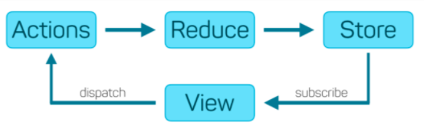

# About the project 
This is a simple node project to showcase how redux works, all the core artifacts of redux like actions and reducer and store are implemented in one file with bare minmum functionalities 
## How to run  
```js
npm install
```
```js
node index.js
```
watch out the console to see the changes in state...

### Code walk through

In the index.js file `initialState` represents the store. myReducer is the reducer and we are dispatching actions using store.dispatch. The view is mocked by console logging inside store.subscribe! Enjoy!

